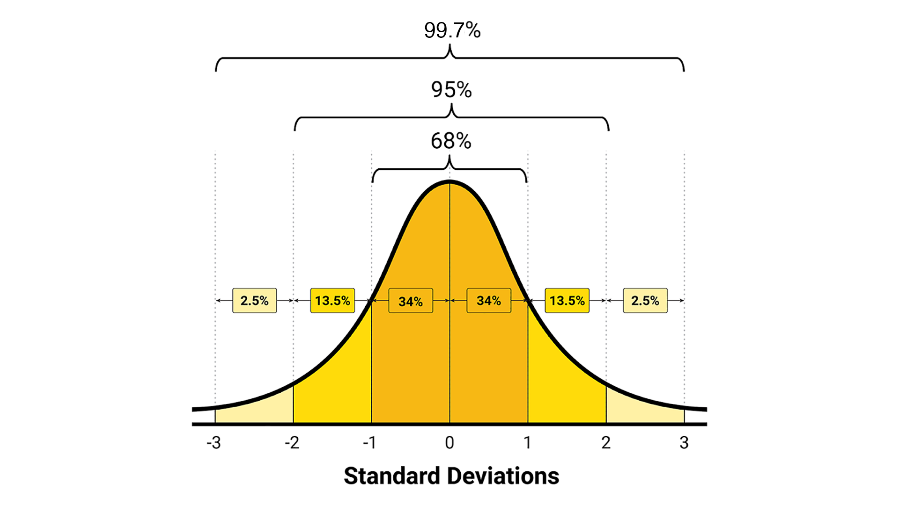
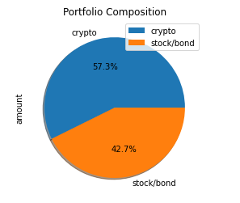

# Challenge_5: Financial Simulations and API's

UNCC Online FinTech Bootcamp Module 5 Challenge due by 11:59pm 1/9/2022



https://courses.bootcampspot.com/courses/980/files/1033388/download

---

## Background

In this Challenge, we’ve decided to start a fintech consulting firm that focuses on projects to benefit local communities. We just won our first contract with a large credit union. The project entails building a tool to help credit union members evaluate their financial health. Specifically, the credit union board wants the members to be able to do two things. First, they should be able to assess their monthly budgets. Second, they should be able to forecast a reasonably effective retirement plan based on their current holdings of cryptocurrencies, stocks, and bonds. The chief technology officer (CTO) of the credit union wants us to develop a prototype application to present at its next assembly.

---

### What's being created

We’ll create two financial analysis tools by using a single Jupyter notebook:

1. A financial planner for emergencies. The members will be able to use this tool to visualize their current savings. The members can then determine if they have enough reserves for an emergency fund.

2. A financial planner for retirement. This tool will forecast the performance of their retirement portfolio in 30 years. To do this, the tool will make an Alpaca API call via the Alpaca SDK to get historical price data for use in Monte Carlo simulations.

 ---

## Technologies

This application is written in Python 3.7 using JupyterLab version 3.0.14.

Python libraries used:
- Pathlib: [https://docs.python.org/3.7/library/pathlib.html](https://docs.python.org/3.7/library/pathlib.html)  
  *Pathlib is a library that enables consistent input and output of files from the main app.*
 - Pandas: [https://pandas.pydata.org/pandas-docs/stable/](https://pandas.pydata.org/pandas-docs/stable/)  
    *Pandas is is an open source, BSD-licensed library providing high-performance, easy-to-use data structures and data analysis tools for the Python programming language.*
 - Requests: [https://docs.python-requests.org/en/master/](https://docs.python-requests.org/en/master/)  
    *Requests is an elegant and simple HTTP library for Python, built for human beings.*
 - JSON: [https://www.json.org/json-en.html](https://www.json.org/json-en.html)  
     *JSON is a lightweight data-interchange format.*
 - OS: [https://www.educba.com/python-os-module/](https://www.educba.com/python-os-module/)
     *Python’s OS Module works as an interface between the Python Programming Language and the Host Operating System.*
 - alpaca-trade-api-python: [https://pypi.org/project/alpaca-trade-api/](https://pypi.org/project/alpaca-trade-api/)
     *alpaca-trade-api-python is a python library for the Alpaca Commission Free Trading API. It allows rapid trading algo development easily, with support for both REST and streaming data interfaces.*

### Installation Guide

prior to running these libraries, install them from the command line:  
  - pandas: `conda install pandas` or `pip install pandas`  
  - pathlib: `pip install pathlib`
  - requests: `python -m pip install requests`
  - alpaca-trade-api: `pip install alpaca-trade-api`
  
---

## Usage

#### Our Jupyter Notebook will be useful in answering the following questions:
 1. What is the composition of the Savings Portfolio?  
 
     *Results may vary based on realtime data*
 
 
 
 2. Credit Union members will be able to evaluate whether their emergency savings would be enough to cover 3 months' worth of income, as seen in the following snippet of code and the resulting determination:
 ```python
 # Evaluate the possibility of creating an emergency fund with 3 conditions:
if total_portfolio > emergency_fund_value:
        print("Congratulations! You have more than 3 months' worth of income in your emergency fund.")
elif total_portfolio == emergency_fund_value:
        print("Congratulations! You have saved 3 months' worth of income in your emergency fund.")
else:
        print(f"You are ${emergency_fund_value - total_portfolio:.2f} away from reaching your emergency fund goal.")
```
     - in our case, the member's emergency fund was sufficient, fetching this message:  
 `Congratulations! You have more than 3 months' worth of income in your emergency fund.`
 
 3. In the "Financial Planner for Retirement" section, we evaluated the possibility of retiring in 30 years vs 10 years.
     - When we ran the 30-year scenario, our resulting confidence interval produced the following statement:  
     `There is a 95% chance that your current balance of $75,353.70 over the next 30 years will end within the range of $1,509,005.29 and $29,820,490.96.`
 
    - When we ran the 10-year scenario, our confidence interval produced the following:  
     `There is a 95% chance that your current balance of $75,353.70 over the next 10 years will end within the range of $151,070.06 and $1,495,079.89.`  
     
 4. Based on the results between 30-year and 10-year, it would appear more prudent to plan on retiring closer to the 30 year mark vs the 10 year mark.
 

---
### Contributors

Geoff Tarleton - jobeycat@protonmail.com

adapted from Starter Code supplied by UNCC FinTech Online Bootcamp by Trilogy Educational Services, a 2U, Inc. brand.

---

### License

MIT